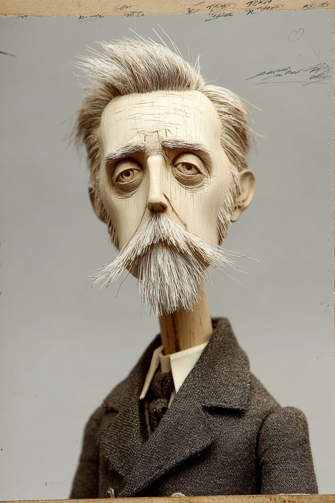
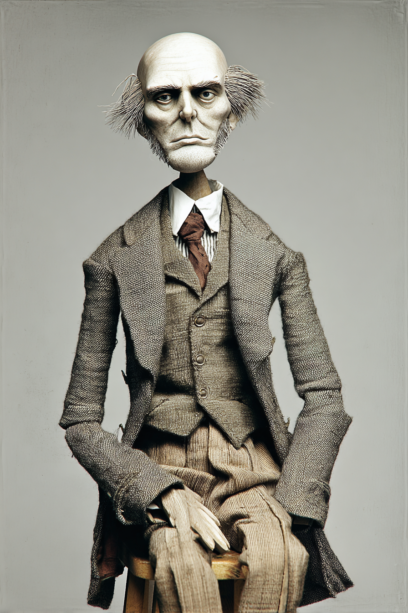
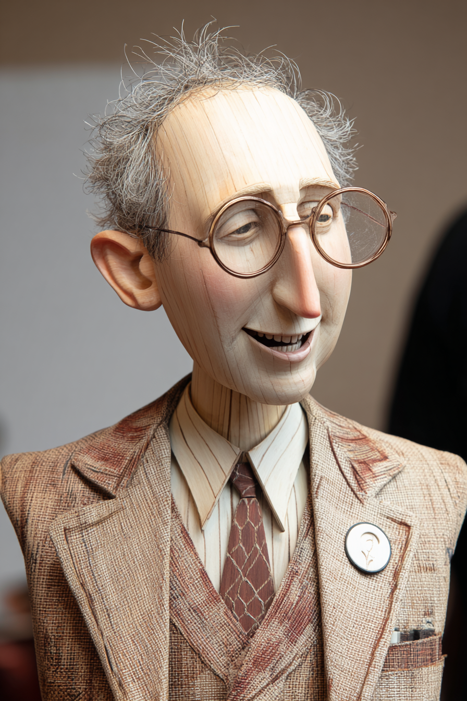
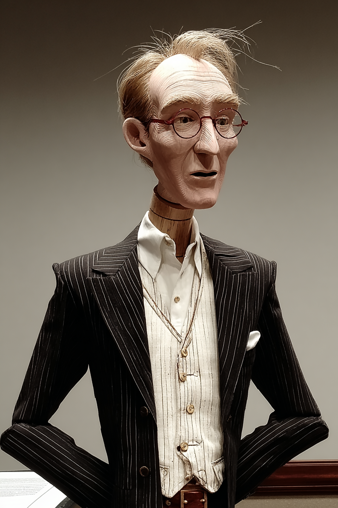
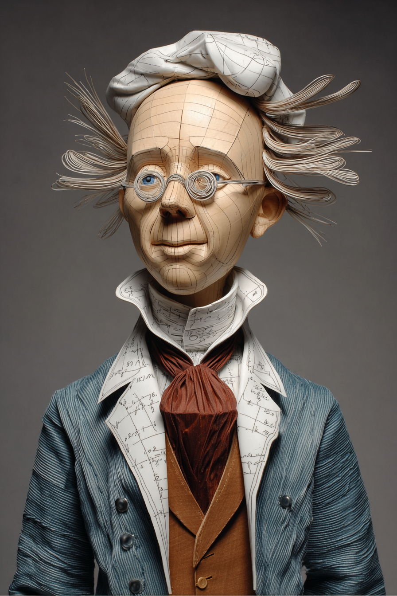

# AI for Graphs A Practitioner's Guide — Wayback Sections

> Extracted from `chapters/`. Each entry corresponds to one chapter file.
> Sections are instructor-authored. Missing sections show a placeholder only.
> Do not edit this file directly — edit the source chapter file, then re-run extraction.

---

## Chapter 00: AI for Graphs A Practitioner's Guide
*Source: `chapters/00-frontmatter.md`*

> **Section not yet authored.** No `## AI Wayback Machine` block found in this chapter file.
> To add this section, edit the source chapter file directly.

---

## Chapter 00: Introduction
*Source: `chapters/00-introduction.md`*

> **Section not yet authored.** No `## AI Wayback Machine` block found in this chapter file.
> To add this section, edit the source chapter file directly.

---

## Chapter 02: Chapter 02 — Claude Basics for D3 Visualization
*Source: `chapters/02-claude-basics-for-d3-visualization-updated.md`*

> **Section not yet authored.** No `## AI Wayback Machine` block found in this chapter file.
> To add this section, edit the source chapter file directly.

---

## Chapter 02: Chapter 02 — Claude Basics for D3 Visualization
*Source: `chapters/02-claude-basics-for-d3-visualization.md`*

##  AI Wayback Machine
The ideas in this chapter didn't appear from nowhere. **Margaret Hamilton** led the team that wrote the Apollo Guidance Computer software in the 1960s — coining the term "software engineering" along the way. Her stack of program listings stood taller than she did. The discipline of "talk to your software carefully and you will get something you didn't expect" was hers.


*Margaret Hamilton, circa 1969. AI-generated portrait based on a public domain photograph (Wikimedia Commons).*


*Puppet Art by [Nik Bear Brown](https://www.nikbearbrown.com/).*

**Run this:**

```
Who was Margaret Hamilton, and how does her work on the Apollo Guidance Computer software connect to the practice of working with code-generating tools like Claude? Keep it to three paragraphs. End with the single most surprising thing about her career or ideas.
```

→ Search **"Margaret Hamilton (software engineer)"** on Wikipedia. See what the model got right, got wrong, or left out.

**Now make the prompt better.** Try one of these:

- Ask it to compare Hamilton's priority-display approach for handling Apollo's alarm system with the way Claude reports errors and warnings while writing D3 code.
- Add a constraint: "Answer as Hamilton's 1969 internal memo on why robust error handling matters in life-critical software."

What changes? What gets better? What gets worse?

---

## Chapter 03: Chapter 3 — Marks and Channels
*Source: `chapters/03-marks-and-channels.md`*

##  AI Wayback Machine
The ideas in this chapter didn't appear from nowhere. **Jock Mackinlay** ranked visual channels by perceptual accuracy in his 1986 dissertation — showing that position beats length beats angle beats color, in roughly that order. The ranking still drives every decision about which channel to use for the most important variable.


*Jock Mackinlay, circa 1986. AI-generated portrait based on a public domain photograph (Wikimedia Commons).*

**Run this:**

```
Who is Jock Mackinlay, and how does his ranking of visual encoding channels connect to the marks-and-channels framework we covered in this chapter? Keep it to three paragraphs. End with the single most surprising thing about his career or ideas.
```

→ Search **"Jock D. Mackinlay"** on Wikipedia. See what the model got right, got wrong, or left out.

**Now make the prompt better.** Try one of these:

- Ask it to walk through one example where Mackinlay's ranking explains why a chart redesign improved (or worsened) readability.
- Ask it to compare Mackinlay's APT system from 1986 with modern automated chart-recommendation tools.

What changes? What gets better? What gets worse?

---

## Chapter 04: Chapter 4 — Chart Selection as Design Decision
*Source: `chapters/04-chart-selection-as-design-decision.md`*

##  AI Wayback Machine
The ideas in this chapter didn't appear from nowhere. **Calvin F. Schmid** was an American sociologist and statistician who wrote *Handbook of Graphic Presentation* (1954) — the first practical manual that walked the reader through *which chart to use for which question*. Before Schmid's book, chart selection was mostly inherited from whatever the previous author had done. After it, the question "key message → data structure → functional category → specific form" had a textbook answer.


*Calvin F. Schmid, circa 1955. AI-generated portrait based on a public domain photograph (Wikimedia Commons).*


*Puppet Art by [Nik Bear Brown](https://www.nikbearbrown.com/).*

**Run this:**

```
Who was Calvin F. Schmid, and how does his chart-selection framework connect to the four-step Cairo workflow we covered in this chapter? Keep it to three paragraphs. End with the single most surprising thing about his career or ideas.
```

→ Search **"Calvin F. Schmid statistician"** on Wikipedia. See what the model got right, got wrong, or left out.

**Now make the prompt better.** Try one of these:

- Ask it to walk through how Schmid's 1954 chart-selection rules would handle the 14-category humanitarian funding dataset from the opening case.
- Ask it to compare Schmid's pre-computer chart-selection guide with Andy Kirk's *Data Visualisation* (2016) — what changed, what didn't.

What changes? What gets better? What gets worse?

---

## Chapter 05: Chapter 05 — Reading a Dataset
*Source: `chapters/05-reading-a-dataset.md`*

##  AI Wayback Machine
The ideas in this chapter didn't appear from nowhere. **John Tukey** invented exploratory data analysis (EDA) in the 1960s and 70s — arguing that the right first move with a dataset is to *look* at it, not test it. He also coined the words "bit" and "software."


*John Tukey, circa 1970. AI-generated portrait based on a public domain photograph (Wikimedia Commons).*

**Run this:**

```
Who was John Tukey, and how does his exploratory data analysis approach connect to the way we read a dataset in this chapter? Keep it to three paragraphs. End with the single most surprising thing about his career or ideas.
```

→ Search **"John Tukey"** on Wikipedia. See what the model got right, got wrong, or left out.

**Now make the prompt better.** Try one of these:

- Ask it to walk through Tukey's "five-number summary" on one specific small dataset — what does it reveal that mean and standard deviation hide?
- Ask it to compare Tukey's pencil-and-paper EDA with the modern dataframe-and-plotting workflow you'd use with Claude.

What changes? What gets better? What gets worse?

---

## Chapter 06: Chapter 6 — Working with Claude Code
*Source: `chapters/06-working-with-claude-code.md`*

##  AI Wayback Machine
The ideas in this chapter didn't appear from nowhere. **Grace Hopper** wrote the first compiler in 1952 — A-0 — arguing that programmers should not write in machine code if a machine could translate from something more human. The chain that runs from her work to "tell Claude what you want" is short.


*Grace Hopper, circa 1960. AI-generated portrait based on a public domain photograph (Wikimedia Commons).*


*Puppet Art by [Nik Bear Brown](https://www.nikbearbrown.com/).*

**Run this:**

```
Who was Grace Hopper, and how does her work on compilers and high-level languages connect to working with code-generating tools like Claude? Keep it to three paragraphs. End with the single most surprising thing about her career or ideas.
```

→ Search **"Grace Hopper"** on Wikipedia.

**Now make the prompt better.** Try one of these:

- Ask it to trace the lineage from A-0 to FLOW-MATIC to COBOL to natural-language prompting.
- Ask it about the actual moth Hopper taped into a logbook — was it really the origin of "debugging"?

What changes? What gets better? What gets worse?

---

## Chapter 07: Chapter 07 — Comparison Charts
*Source: `chapters/07-comparison-charts.md`*

##  AI Wayback Machine
The ideas in this chapter didn't appear from nowhere. **William Playfair** invented the bar chart, line graph, and pie chart in his 1786 *Commercial and Political Atlas* — and used them to make political arguments about British trade. Most of the chart vocabulary you use today is his.


*William Playfair, circa 1800. AI-generated portrait based on a public domain engraving (Wikimedia Commons).*

**Run this:**

```
Who was William Playfair, and how do his 1786 chart inventions connect to the comparison charts we covered in this chapter? Keep it to three paragraphs. End with the single most surprising thing about his career or ideas.
```

→ Search **"William Playfair"** on Wikipedia.

**Now make the prompt better.** Try one of these:

- Ask it to redraw Playfair's bar chart of Scottish imports in modern D3 conventions — what changes about the message?
- Ask it about Playfair's side career as a banker, fraudster, and rumored spy.

What changes? What gets better? What gets worse?

---

## Chapter 08: Chapter 8 — Time Series and Temporal Charts
*Source: `chapters/08-time-series-and-temporal-charts.md`*

##  AI Wayback Machine
The ideas in this chapter didn't appear from nowhere. **Étienne-Jules Marey** was a 19th-century French physiologist who developed the "graphical method" — recording heartbeats, gait, and bird flight as continuous time-series traces on paper. He believed the trace was a more honest record than the human eye.


*Étienne-Jules Marey, circa 1885. AI-generated portrait based on a public domain photograph (Wikimedia Commons).*



*Puppet Art by [Nik Bear Brown](https://www.nikbearbrown.com/).*

**Run this:**

```
Who was Étienne-Jules Marey, and how does his graphical method connect to the time-series and temporal charts we covered in this chapter? Keep it to three paragraphs. End with the single most surprising thing about his career or ideas.
```

→ Search **"Étienne-Jules Marey"** on Wikipedia.

**Now make the prompt better.** Try one of these:

- Ask it to compare Marey's chronophotographs of horses in motion with the modern small-multiples approach to time-series.
- Ask it to describe Marey's sphygmograph — what physiological signal it captured, and how.

What changes? What gets better? What gets worse?

---

## Chapter 09: Chapter 09 — Distribution Charts
*Source: `chapters/09-distribution-charts.md`*

##  AI Wayback Machine
The ideas in this chapter didn't appear from nowhere. **Adolphe Quetelet** coined "the average man" in 1835 — proposing that human traits (height, chest circumference, criminal tendency) follow normal distributions. He gave statistics the conceptual tools to think about populations as distributions, not lists.


*Adolphe Quetelet, circa 1860. AI-generated portrait based on a public domain photograph (Wikimedia Commons).*

**Run this:**

```
Who was Adolphe Quetelet, and how does his "average man" framework connect to the distribution charts we covered in this chapter? Keep it to three paragraphs. End with the single most surprising thing about his career or ideas.
```

→ Search **"Adolphe Quetelet"** on Wikipedia.

**Now make the prompt better.** Try one of these:

- Ask it to walk through Quetelet's 1846 fit of Scottish soldier chest measurements to a normal curve — and what made it convincing at the time.
- Ask it about the eugenics-adjacent reception of Quetelet's ideas in the late 19th century — what survived and what was discarded.

What changes? What gets better? What gets worse?

---

## Chapter 10: Chapter 10 — Relationship and Correlation Charts
*Source: `chapters/10-relationship-and-correlation-charts.md`*

##  AI Wayback Machine
The ideas in this chapter didn't appear from nowhere. **Francis Galton** drew the first scatter plot in 1885 to compare parents' and children's heights — and named the resulting downward-sloping pattern "regression toward the mean." His statistical instincts were brilliant; his applications of them (founding eugenics) were catastrophic.


*Francis Galton, circa 1890. AI-generated portrait based on a public domain photograph (Wikimedia Commons).*



*Puppet Art by [Nik Bear Brown](https://www.nikbearbrown.com/).*

**Run this:**

```
Who was Francis Galton, and how does his invention of the scatter plot connect to the relationship and correlation charts we covered in this chapter? Keep it to three paragraphs. End with the single most surprising thing about his career or ideas.
```

→ Search **"Francis Galton"** on Wikipedia.

**Now make the prompt better.** Try one of these:

- Ask it to walk through Galton's height-and-regression experiment, and explain what "regression to the mean" actually does and doesn't say.
- Ask it to confront the entanglement of Galton's statistical innovations with his founding role in eugenics.

What changes? What gets better? What gets worse?

---

## Chapter 11: Chapter 11 — Part-to-Whole Charts
*Source: `chapters/11-part-to-whole-charts.md`*

##  AI Wayback Machine
The ideas in this chapter didn't appear from nowhere. **Georg von Mayr** was a 19th-century German statistician who built systematic part-to-whole charts (pie variants, stacked bars, area diagrams) to display the components of state and demographic data — and helped move statistics from text tables to visual reasoning.


*Georg von Mayr, circa 1900. AI-generated portrait based on a public domain photograph (Wikimedia Commons).*

**Run this:**

```
Who was Georg von Mayr, and how does his early statistical graphics work connect to the part-to-whole charts we covered in this chapter? Keep it to three paragraphs. End with the single most surprising thing about his career or ideas.
```

→ Search **"Georg von Mayr"** on Wikipedia.

**Now make the prompt better.** Try one of these:

- Ask it to recreate one of von Mayr's 1870s demographic part-to-whole charts in modern D3 — what changes about the message?
- Ask it to compare his approach with Playfair's a century earlier — what did each contribute?

What changes? What gets better? What gets worse?

---

## Chapter 12: Chapter 12 — Hierarchy Charts
*Source: `chapters/12-hierarchy-charts.md`*

##  AI Wayback Machine
The ideas in this chapter didn't appear from nowhere. **Ben Shneiderman** invented the treemap in 1990 — to display hierarchical disk usage on his hard drive without wasted screen space. The algorithm now displays everything from stock-market sectors to government budgets to file-system contents.


*Ben Shneiderman, circa 1991. AI-generated portrait based on a public domain photograph (Wikimedia Commons).*



*Puppet Art by [Nik Bear Brown](https://www.nikbearbrown.com/).*

**Run this:**

```
Who is Ben Shneiderman, and how does his invention of the treemap connect to the hierarchy charts we covered in this chapter? Keep it to three paragraphs. End with the single most surprising thing about his career or ideas.
```

→ Search **"Ben Shneiderman"** on Wikipedia.

**Now make the prompt better.** Try one of these:

- Ask it to walk through the original "slice-and-dice" treemap algorithm — what it does well, and what later "squarified" treemaps improved.
- Ask it about Shneiderman's "visual information seeking mantra" — overview, zoom, filter, details on demand.

What changes? What gets better? What gets worse?

---

## Chapter 13: Chapter 13 — Flow and Network Charts
*Source: `chapters/13-flow-and-network-charts.md`*

##  AI Wayback Machine
The ideas in this chapter didn't appear from nowhere. **Charles Joseph Minard** drew the 1869 flow map of Napoleon's Russian campaign — combining six variables (army size, location, direction, temperature, distance, time) in a single image. Tufte called it possibly "the best statistical graphic ever drawn."


*Charles Joseph Minard, circa 1860. AI-generated portrait based on a public domain engraving (Wikimedia Commons).*

**Run this:**

```
Who was Charles Joseph Minard, and how does his Napoleon's-march flow map connect to the flow and network charts we covered in this chapter? Keep it to three paragraphs. End with the single most surprising thing about his career or ideas.
```

→ Search **"Charles Joseph Minard"** on Wikipedia.

**Now make the prompt better.** Try one of these:

- Ask it to enumerate the six variables in Minard's map and explain how each was visually encoded.
- Ask it to compare Minard's flow map with the modern Sankey diagram (Chapter 62) — what's shared, what's different?

What changes? What gets better? What gets worse?

---

## Chapter 14: Chapter 14 — Spatial and Geographic Charts
*Source: `chapters/14-spatial-and-geographic-charts.md`*

##  AI Wayback Machine
The ideas in this chapter didn't appear from nowhere. **John Snow** mapped the 1854 Broad Street cholera outbreak in London — using a dot map of deaths to identify a single contaminated pump. The map became the founding case for spatial epidemiology and one of the most influential pieces of data visualization ever made.


*John Snow, circa 1856. AI-generated portrait based on a public domain photograph (Wikimedia Commons).*


*Puppet Art by [Nik Bear Brown](https://www.nikbearbrown.com/).*

**Run this:**

```
Who was John Snow, and how does his Broad Street cholera map connect to the spatial and geographic charts we covered in this chapter? Keep it to three paragraphs. End with the single most surprising thing about his career or ideas.
```

→ Search **"John Snow"** on Wikipedia.

**Now make the prompt better.** Try one of these:

- Ask it to walk through how Snow's dot map, combined with the Voronoi-like analysis he sketched, isolated the pump as the cause.
- Ask it to compare Snow's 1854 mapping with modern outbreak surveillance dashboards.

What changes? What gets better? What gets worse?

---

## Chapter 15: Chapter 15 — Specialized and Financial Charts
*Source: `chapters/15-specialized-and-financial-charts.md`*

##  AI Wayback Machine
The ideas in this chapter didn't appear from nowhere. **Munehisa Homma** was an 18th-century Japanese rice trader who developed the candlestick charting technique to track price action in the Osaka rice futures market — the earliest organized derivatives exchange. His method reached the West only in the 1990s.


*Munehisa Homma, 18th century. AI-generated illustration based on a public domain painting (Wikimedia Commons).*

**Run this:**

```
Who was Munehisa Homma, and how does his rice-trading candlestick technique connect to the specialized financial charts we covered in this chapter? Keep it to three paragraphs. End with the single most surprising thing about his career or ideas.
```

→ Search **"Munehisa Homma"** on Wikipedia.

**Now make the prompt better.** Try one of these:

- Ask it to read one candlestick (open, high, low, close, body, wicks) the way Homma would have.
- Ask it about the structure of the Dōjima Rice Exchange — what made it the first true futures market.

What changes? What gets better? What gets worse?

---

## Chapter 16: Chapter 16 — Design Principles in Practice
*Source: `chapters/16-design-principles-in-practice.md`*

##  AI Wayback Machine
The ideas in this chapter didn't appear from nowhere. **Edward Tufte** published *The Visual Display of Quantitative Information* in 1983 — and coined the terms "chartjunk," "data-ink ratio," and "sparklines." His insistence on stripping decoration from charts continues to shape how serious data graphics get made.


*Edward Tufte, circa 1983. AI-generated portrait based on a public domain photograph (Wikimedia Commons).*



*Puppet Art by [Nik Bear Brown](https://www.nikbearbrown.com/).*

**Run this:**

```
Who is Edward Tufte, and how do his design principles connect to the practical chart design work we covered in this chapter? Keep it to three paragraphs. End with the single most surprising thing about his career or ideas.
```

→ Search **"Edward Tufte"** on Wikipedia.

**Now make the prompt better.** Try one of these:

- Ask it to apply Tufte's data-ink-ratio principle to a bar chart you'd build in D3 — what gets stripped?
- Ask it to discuss criticisms of Tufte's "chartjunk" framing — when does decoration actually help comprehension?

What changes? What gets better? What gets worse?

---

## Chapter 17: Chapter 17 — Building a Complete Project
*Source: `chapters/17-building-a-complete-project.md`*

##  AI Wayback Machine
The ideas in this chapter didn't appear from nowhere. **Buckminster Fuller** spent decades insisting that a designer's job is not to make objects but to make the whole system legible to the people who have to live with it. His Dymaxion map and the *World Game* were enormous communication projects: a data narrative wrapped around a verifiable artifact, end to end. The complete-project discipline of this chapter — README to chart to audit log — is Fuller's idea of legibility scaled down.


*Buckminster Fuller, circa 1962. AI-generated portrait based on a public domain photograph (Wikimedia Commons).*

**Run this:**

```
Who was Buckminster Fuller, and how does his approach to large communication projects connect to the build-a-complete-project workflow we covered in this chapter? Keep it to three paragraphs. End with the single most surprising thing about his career or ideas.
```

→ Search **"Buckminster Fuller Dymaxion"** on Wikipedia. See what the model got right, got wrong, or left out.

**Now make the prompt better.** Try one of these:

- Ask it to compare Fuller's *World Game* presentations with a modern data-journalism feature like the NYT's COVID dashboard — what makes them complete projects.
- Ask it to describe how Fuller's principle of "comprehensive anticipatory design science" applies to building a portfolio of D3 charts that age well.

What changes? What gets better? What gets worse?

---

## Chapter 18: Part II — Examples
*Source: `chapters/18-arc-diagram.md`*

##  AI Wayback Machine
The ideas in this chapter didn't appear from nowhere. **Leonhard Euler** solved the Königsberg-bridges puzzle in 1735 by abstracting a city into nodes and edges and asking which path crossed each bridge exactly once. That single diagram founded graph theory — the mathematics that arc diagrams, force-directed networks, and every modern network visualization are built on. The arcs in this chapter trace back to those bridges.


*Leonhard Euler, circa 1750. AI-generated portrait based on a public domain engraving (Wikimedia Commons).*



*Puppet Art by [Nik Bear Brown](https://www.nikbearbrown.com/).*

**Run this:**

```
Who was Leonhard Euler, and how does his solution to the Königsberg-bridges problem connect to the arc-diagram form we covered in this chapter? Keep it to three paragraphs. End with the single most surprising thing about his career or ideas.
```

→ Search **"Leonhard Euler Königsberg bridges"** on Wikipedia. See what the model got right, got wrong, or left out.

**Now make the prompt better.** Try one of these:

- Ask it to walk through how Euler's bridge-crossing condition (every vertex has even degree, except possibly the start and end) shows up when modern arc diagrams are checked for visual legibility.
- Ask it to compare Euler's purely topological diagram with what a modern arc diagram adds on top — order along the axis, arc length, weighting.

What changes? What gets better? What gets worse?

---

## Chapter 18: Chapter 16 — The Brutalist Claude Project
*Source: `chapters/18-brutalist-claude-project.md`*

##  AI Wayback Machine
The ideas in this chapter didn't appear from nowhere. **Le Corbusier** championed *béton brut* — raw concrete left honest, marks of the wooden formwork visible — in projects like the Unité d'Habitation (1952) and the Chandigarh capitol complex. The aesthetic that gave brutalism its name was a moral claim: show the structure, do not disguise it. The Brutalist Claude project applies the same rule to charts. The grid is visible. The data is the ornament.


*Le Corbusier, circa 1953. AI-generated portrait based on a public domain photograph (Wikimedia Commons).*

**Run this:**

```
Who was Le Corbusier, and how does his architectural philosophy of *béton brut* connect to the brutalist visualization aesthetic we covered in this chapter? Keep it to three paragraphs. End with the single most surprising thing about his career or ideas.
```

→ Search **"Le Corbusier béton brut"** on Wikipedia. See what the model got right, got wrong, or left out.

**Now make the prompt better.** Try one of these:

- Ask it to compare Le Corbusier's Unité d'Habitation (1952) with the brutalist web style guide — which design rules transfer cleanly, which don't.
- Ask it to describe what "truth to materials" means in concrete versus what it means in a D3 chart rendered as SVG.

What changes? What gets better? What gets worse?

---

## Chapter 97: The Fundamental Themes
*Source: `chapters/97-fundamenta-themes.md`*

> **Section not yet authored.** No `## AI Wayback Machine` block found in this chapter file.
> To add this section, edit the source chapter file directly.

---

## Chapter 99: 99 Back Matter
*Source: `chapters/99-back-matter.md`*

> **Section not yet authored.** No `## AI Wayback Machine` block found in this chapter file.
> To add this section, edit the source chapter file directly.

---
